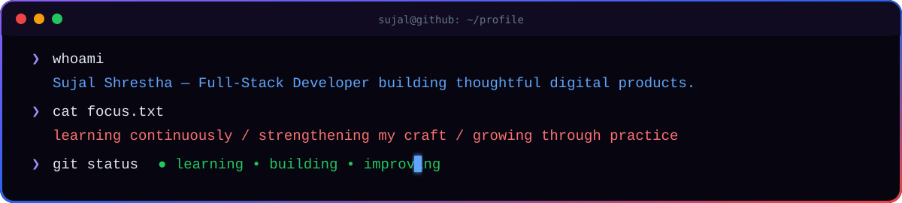
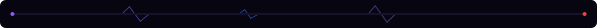
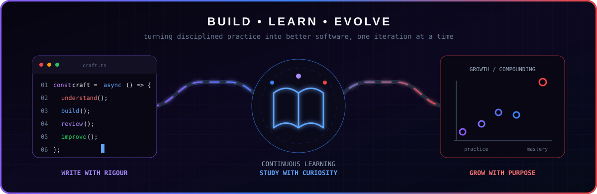
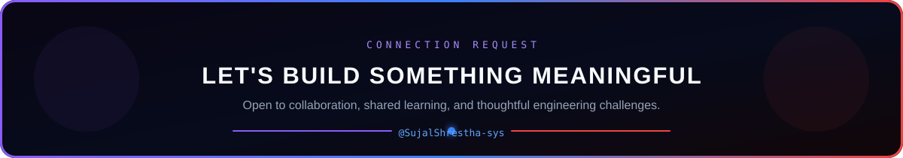

<!--
  GitHub Profile README for Sujal Shrestha
  Confirmed GitHub handle: SujalShrestha-sys
-->

<div align="center">

  

  <br />

  <a href="https://github.com/SujalShrestha-sys">
    
  </a>
  <a href="https://github.com/SujalShrestha-sys?tab=followers">
    
  </a>
  <a href="https://github.com/SujalShrestha-sys?tab=repositories">
    
  </a>

</div>

<br />



## `> system.profile`

```yaml
name: Sujal Shrestha
role: Full-Stack Developer
mission: Learn continuously and build useful, reliable software
current_focus:
  - Strengthening full-stack fundamentals
  - Building practical end-to-end applications
  - Growing through deliberate practice
operating_mode: Learn deeply. Build carefully. Improve consistently.
```

I am a full-stack developer committed to continuous learning and deliberate growth. Every project is an opportunity to strengthen my fundamentals, explore better approaches, and turn new knowledge into useful, maintainable software.



## `> tech.arsenal`

<div align="center">

  

  <br /><br />

  `TypeScript` · `JavaScript` · `Java` · `Python` · `React` · `Next.js`<br />
  `NestJS` · `Node.js` · `Prisma` · `MySQL` · `Tailwind CSS` · `Git`

</div>

## `> live.telemetry`

<div align="center">

  
  

  
  

  

</div>

> [!NOTE]
> Language cards summarize public repository activity and do not represent a proficiency ranking.

## `> contribution.stream`

<div align="center">

  <a href="https://github.com/SujalShrestha-sys">
    
  </a>

</div>

## `> featured.repositories`

<table>
  <tr>
    <td width="50%">
      <h3><a href="https://github.com/SujalShrestha-sys/nestjs-crud-practice">01 / NestJS CRUD Practice</a></h3>
      <p>Backend architecture with Prisma, Better Auth, validation, role-based access control, and Arcjet protection.</p>
      <p><code>TypeScript</code> <code>NestJS</code> <code>Prisma</code> <code>RBAC</code></p>
      <a href="https://github.com/SujalShrestha-sys/nestjs-crud-practice"><strong>View repository →</strong></a>
    </td>
    <td width="50%">
      <h3><a href="https://github.com/SujalShrestha-sys/ClashAThon-TheFrictionFixers-MeroPaalo">02 / MeroPaalo</a></h3>
      <p>A queue-management system backend created by The Friction Fixers for Clash-A-Thon.</p>
      <p><code>JavaScript</code> <code>Backend</code> <code>Hackathon</code></p>
      <a href="https://github.com/SujalShrestha-sys/ClashAThon-TheFrictionFixers-MeroPaalo"><strong>View repository →</strong></a>
    </td>
  </tr>
  <tr>
    <td width="50%">
      <h3><a href="https://github.com/SujalShrestha-sys/MealMate">03 / MealMate</a></h3>
      <p>A smart campus meal subscription and ordering platform with scheduling, payments, inventory, and feedback.</p>
      <p><code>React</code> <code>Node.js</code> <code>Prisma</code> <code>PostgreSQL</code></p>
      <a href="https://github.com/SujalShrestha-sys/MealMate"><strong>View repository →</strong></a>
    </td>
    <td width="50%">
      <h3><a href="https://github.com/SujalShrestha-sys/Terminal-Adventure">04 / Terminal Adventure</a></h3>
      <p>A terminal-based player-versus-enemy game featuring attack, block, and healing mechanics.</p>
      <p><code>Python</code> <code>Game Logic</code> <code>CLI</code></p>
      <a href="https://github.com/SujalShrestha-sys/Terminal-Adventure"><strong>View repository →</strong></a>
    </td>
  </tr>
</table>

<div align="center">

  <a href="https://github.com/SujalShrestha-sys?tab=repositories">
    
  </a>

</div>

## `> build.learn.evolve`



## `> establish.connection`

<div align="center">

  

  <br /><br />

  <a href="https://github.com/SujalShrestha-sys">
    
  </a>
  <a href="https://github.com/SujalShrestha-sys?tab=repositories">
    
  </a>
  <a href="https://github.com/SujalShrestha-sys/nestjs-crud-practice/issues">
    
  </a>

  <br /><br />

  

  <sub>© Sujal Shrestha · Learning continuously, building deliberately, growing consistently.</sub>

</div>
